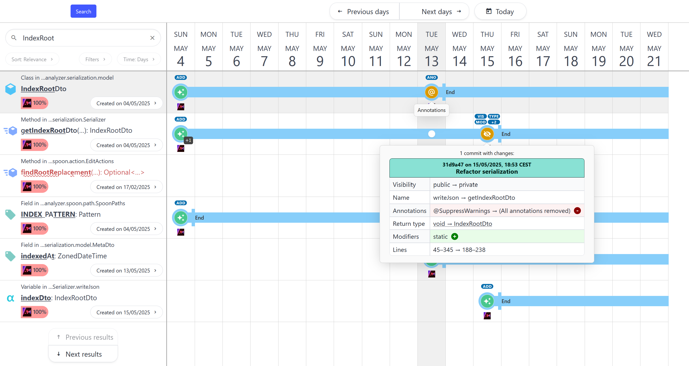

# Symbol History Visualization

This repository contains the source code for the software artifact associated with André Mategka's 2026 diploma thesis on "The Visualization of Symbol-Level Code Changes Across Version Control History".



## Citing this software

This repository contains a [CITATION](CITATION.cff) file. You can use GitHub's ["Cite this repository" feature](https://docs.github.com/en/repositories/managing-your-repositorys-settings-and-features/customizing-your-repository/about-citation-files) to create a corresponding BibTeX entry.

## Local deployment

<details>
<summary>Click to view requirements</summary>
Requires Java JDK 21+ (tested with Oracle OpenJDK 21.0.6) and Node.js 20.19.0+ (tested with Node.js 24.9.0).

If installed, Maven should have version 3.9+ (tested with Maven 3.9.9) and the `MAVEN_HOME` environment variable should be set, otherwise `mvnw` will download an appropriate version automatically.
</details>

Run the analyzer backend on a repository of your choice:

```bash
cd analyzer
./mvnw package -DskipTests
java -jar target/analyzer.jar "<path to your repository here>"
```

Progress bars indicating indexing and serialization progress are automatically printed. After completion, the results can be found in a file called `result.json`.

Copy it to the frontend:

```bash
cp result.json ../frontend/public/
```

Then start the visualization frontend:

```bash
cd ../frontend/
npm install
npm run dev
```

## Docker deployment

<details>
<summary>Click to view requirements</summary>
Requires Docker with Docker Compose v2 (tested with Docker 28.0.1 on windows/amd64 using the WSL2 backend and Docker Compose 2.33.1-desktop.1).
</details>

Update the `.env` file:

```dotenv
# The path to the repository you would like to index (required)
VIS_REPOSITORY_PATH=D:/folder/myrepository
# The name of the repository (required)
VIS_REPOSITORY_NAME=myrepository
# Visualization frontend port on the host (required)
VIS_PORT=5173
```

Note that the repository path can point to anywhere in your repository, but ideally, you should point it to your repository's root directory (where the `.git` directory resides).

`VIS_REPOSITORY_NAME` should mirror the name of your repository directory and is required to be a valid Unix directory name.

For more information about the format for these values, including how to handle special characters, see [the Docker Compose documentation](https://docs.docker.com/reference/compose-file/services/#env_file-format).

Run with Compose:

```bash
docker compose up
```

Note that progress indicators will not be shown in the Docker CLI while the analysis backend indexes your repository. The visualization frontend will launch when the analysis is complete, available at the port you specified in the `.env` file.

## License

[MIT](https://opensource.org/licenses/MIT)

Copyright (c) 2024 André Mategka

This repository contains parts of other free open-source projects. For more information, see [NOTICE](NOTICE).
